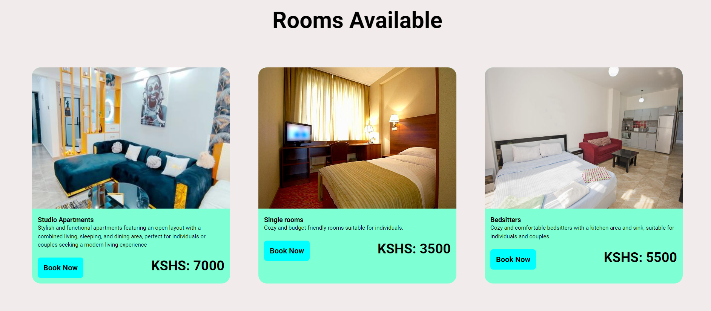
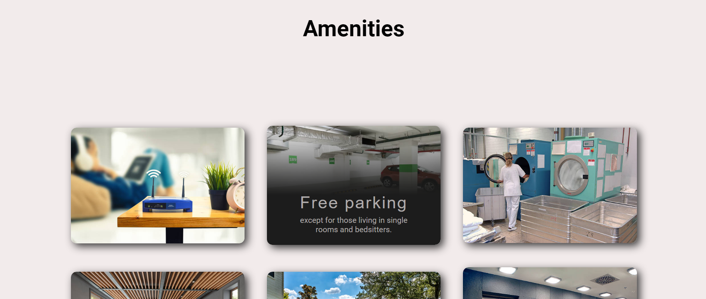
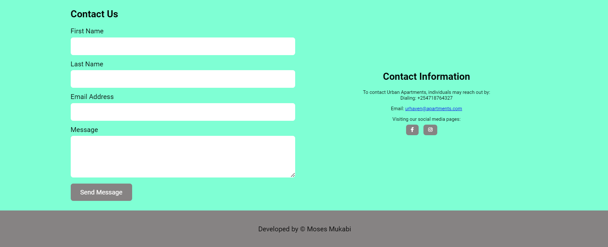

# Havens landing page 
## To use this code, use the set up below  
- download and install browser eg ``` chrome```  
- Install a coding enviroment most prefered ```vs code```  
- install ```node.js```  
- create an account with ```github``` using this link [github](https://github.com/login)
- clone this repository using this ```https://github.com/mosesmukabi/Haven-appartment```  
- Create a branch and make your changes then create a ```pull request```  


## Here are images of the different sections available on the page  
### Header section
Navigation, header and hero section their design are as follows  
  

### Rooms section
this section contains the rooms available which have different features
  

### Amenities section  
this section contains available amenities in havens hotel
  

### About section
this section shows more info about the hotel and also a video to preview the hotel.  
  

### Feedback and footer section
In this section one can leave a feedback of experiences of reviews
  
# Thank You All


